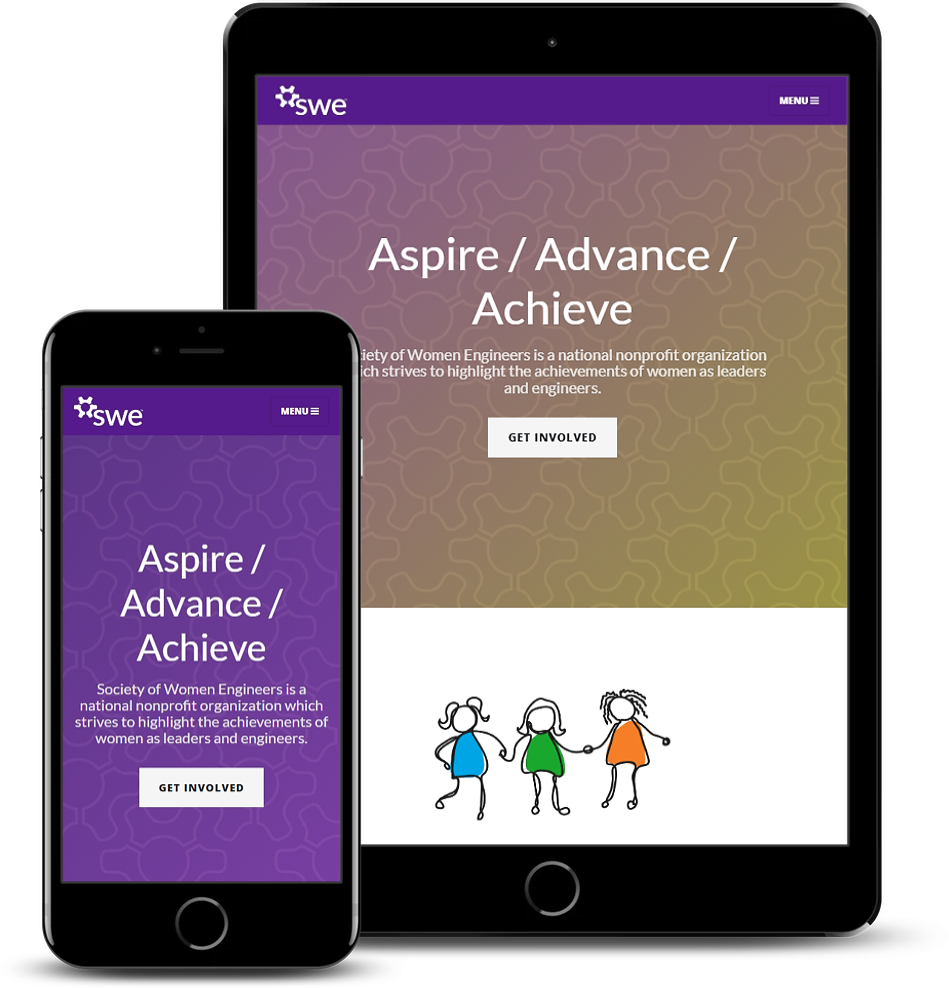

# Society of Women Engineers | ULL Website
https://www.sweull.org/

This is the mobile responive website I built for my school's Society of Women Engineers section.

## Built With
* Languages
  * Python 3.7.3
  * JavaScript 
  * HTML5
  * CSS3
* Frameworks / APIs
  * [Django 2.2.1](https://www.djangoproject.com/)
  * [Bootstrap 4](https://getbootstrap.com/)
  * [Clean Blog](https://startbootstrap.com/themes/clean-blog/)
  * [Lightbox 2](https://lokeshdhakar.com/projects/lightbox2/)
  * [baguetteBox](https://feimosi.github.io/baguetteBox.js/)
  * [Gspread](https://github.com/burnash/gspread)
  * [Google Sheets API](https://developers.google.com/sheets/api/)
  * [Chartist-js 0.11.3](https://gionkunz.github.io/chartist-js/)
  
* IDEs / Text Editors
  * JetBrain Pycharm
  * Visual Studio Code
* Version Control
  * Git  with hosting on  GitHub
  * GitKraken
  

## Authors

* **Al Sharairi**

## Acknowledgments

* Big thanks to Mozilla's wonderful [Getting started with the Web](https://developer.mozilla.org/en-US/docs/Learn/Getting_started_with_the_web) guide. I went from knowing nothing about web develpoment to making this website in a few months, and I will forever be in your debt becasue of it

* [SWE's Branding Guidelines](https://swe.org/membership/member-resources/swe-brand-guidelines-logos-and-templates/)
for backgrounds, color values, and design inspiration 

## License

* This project is licensed under the MIT License
